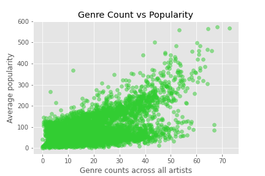

# spotify
Spotify is the leading music streaming service in the world. Using [this dataset](https://www.kaggle.com/yamaerenay/spotify-dataset-19212020-160k-tracks), 1.1 million rows of artist data (including their name, number of followers, genre tags, and popoularity) along with 586,000 rows of track data (including 11 numerical features describing the acoustic signature, along with categorical data such as the affiliated artists and release date). The data was collected in April 2021, but track release dates span to 1922.

The primary goal is to orient this data around musical genre, and determine how genres change over time. First, we'll evaluate the current state of Spotify genres (from April 2021 when the data was collected). Then, by linking track release dates to artist genre tags, we can examine how genres have changed over time -- both in terms of their relative popularity and their acoustic signatures. 

# EDA
### Modern genre popularity

This analysis is heavily reliant on Spotify's "popularity" feature for artists, which 

"The popularity of the artist. The value will be between 0 and 100, with 100 being the most popular. The artist’s popularity is calculated from the popularity of all the artist’s tracks."

. Popularity ranges from 0 to 100. Artists are, on average, highly unpopular -- 21% of all artists are at 0! The music world is brutal. Popularity is strongly correlated with followers, but includes a temporal component that accounts for current play counts in addition to follower counts.

Genre data is associated with artists (but not tracks -- we'll deal with that later). Among the 1,104,349 artists, only about a quarter (298,616) have any genres associated with them.

After removing the empty genre tags, there are 48,787 genre combinations based on 5,365 unique tags. Some of the rarest genres include 'whale song', 'myanmar hip hop', 'albanian iso polyphony' and 'mindfulness'.

Half of all genres are observed 61 or fewer times, while the most common genres have nearly 600 tagged artists.

The average popularity of a genre is strongly related to the number of artists tagged. Some genres, such as 'classical performance' are unpopular in the context of their artist abundance.

Interestingly, the most rare genres have relatively high popularity -- their uniqueness probalby helps them to stand out -- but still pale in comparison to the dominant genres.

./img/top_10_genres_count_and_pop_bar.png)
./img/bottom_10_genres_count_and_pop_bar.png)

Does genre count track with popularity? For record companies looking to sign an aspiring artist, is there an appetite on Spotify for their genre? Or is the competition stiff?

To evaluate this, we can calculate a "demand" metric, based on the popularity of a genre divided by the number of artists already associated with that genre. A high demand would indicate relatively low competition given the current appetite for a particular genre.

For example, the lowest demand score in the dataset is for 'neo-proto' (also known as neo-progressive rock). This genre has 145 associated artists, yet it's average popularity is only 0.39. Don't sign any neo-proto artists expecting Spotify dividends.

On the other hand, 'singer-songwriter' is a 

# Search for your favorite genre, returns current demand and projected demand
    * Current demand is interpretted as, is it a good idea to sign someone now?
    * projected demand increasing suggests signing NOW, decreasing suggests avoiding

# Search for an artist, find out what their most popular genre is, and what genres they might want to play more of in the future to gain popularity

# Highest popularity with the lowest follower count would indicate a rising artist