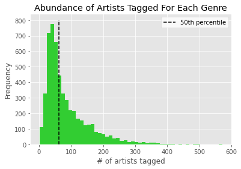
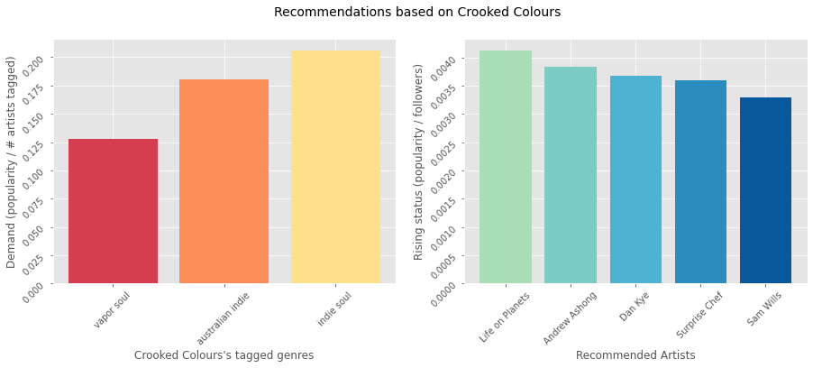

# spotify
Spotify is the leading music streaming service in the world. Using [this dataset](https://www.kaggle.com/yamaerenay/spotify-dataset-19212020-160k-tracks), 1.1 million rows of artist data (including their name, number of followers, genre tags, and popoularity) along with 586,000 rows of track data (including 11 numerical features describing the acoustic signature, along with categorical data such as the affiliated artists and release date). The data was collected in April 2021, but track release dates span to 1922.

The primary goal is to orient this data around musical genre, and determine how genres change over time. First, we'll evaluate the current state of Spotify genres (from April 2021 when the data was collected). Then, by linking track release dates to artist genre tags, we can examine how genres have changed over time -- both in terms of their relative popularity and their acoustic signatures. 

# EDA
### Modern genre popularity

This analysis is heavily reliant on Spotify's "popularity" metric for artists, which is primarily based on the total number of plays and how recent they are -- so there is a temporal bias for plays in April 2021. Popularity ranges from 0 to 100, and scales logarithmically with artist follower counts.

Artists are, on average, highly unpopular -- 21% of all artists are at 0 popularity!

Genre data is associated with artists (but not tracks -- we'll deal with that later). Among the 1,104,349 artists, only 27% (298,616) have any genres associated with them.

After removing the empty genre tags, there are 5,365 unique genres that constitute 48,787 genre combinations. Some of the rarest genres include 'whale song', 'iowa hip hop', and 'albanian iso polyphony'.

Half of all genres are observed 61 or fewer times, while the most common genres have nearly 600 tagged artists.

The average popularity of a genre is strongly related to the number of artists tagged. Some top genres, such as 'classical performance' are unpopular in the context of their artist abundance.

Interestingly, the most rare genres have relatively high popularity -- their uniqueness probalby helps them to stand out -- but still pale in comparison to the popularity of the dominant genres.

How can this relationship between genre and popularity be useful? Imagine a record label is interested in signing an up-and-coming artist, but isn't sure how their content fits in with the current interests of the Spotify community.

Here I calculated a 'demand' metric, calcluated by dividing average popularity by the number of tagged artists for that genre. A genre garnering lots of popularity, yet lacking in artists producing that content, would recieve a high 'demand' score.

There is a heavy skew in the demand distribution, given that uncommon genres seem to attract disproportional popularity. If we assume a record label isn't interested in taking a chance on a relatively unknown genre, the distribution and data below excludes the bottom 50% of genres (61 or fewer artists tagged) along with genres that have a popularity of 0 (for which demand cannot be calculated).

At the bottem end of the distrubtion, genres such as 'neo-proto' and 'vintage western' are extremely low demand (~0.003)-- there are more than enough artists on Spotify fulfilling the needs of listeners for that music. On the other hand, 'viral rap', 'melodic rap', and 'girl group' are in high demand(0.90, 0.78, 0.77 respectively), given their popularity relative to the low number of artists producing such content. 

### Using in-demand genres to recommend other artists

The artist_recommender.py script takes the name of an artist, and returns their tagged genres, the demand of each of those genres, and 5 relatively unknown artists that play the highest demand genre.

Those 5 relatively unknown artist are selected based on a 'rising' metric, calculated by their popularity divided by their followers. This helps to bias artists for recent plays, especially if not many people follow them yet. A default minimum number of followers is set to 10,000 so that recommended artists aren't completely underground.

For example, by entering "Magic City Hippies" into the script, the following information is returned:

"Magic City Hippies is in the top 0% of rising artists
Their 'miami indie' music is the most in-demand"

